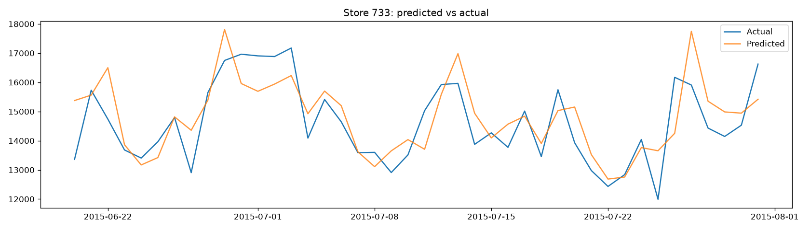

# Retail Sales Forecasting

A portfolio project forecasting store-level daily sales, built around the
[Rossmann Store Sales](https://www.kaggle.com/c/rossmann-store-sales) dataset
(Kaggle). The pipeline goes from raw data → EDA → baselines → classical
time series models → gradient-boosted ML model → evaluation & error analysis.

## Why this project

Sales forecasting is one of the most directly business-relevant time series
problems (inventory, staffing, cash flow planning). This project is
structured to show the full toolkit, not just one model:

- Proper time-respecting train/test splits (no shuffling)
- Baselines first, so improvements are provably real
- Classical statistical models (SARIMA / Prophet)
- ML with engineered lag/rolling features (XGBoost / LightGBM)
- Store-level error analysis, not just an aggregate metric

## Getting the data

1. Create a free Kaggle account if you don't have one.
2. Go to the [Rossmann Store Sales competition](https://www.kaggle.com/c/rossmann-store-sales/data)
   and download `train.csv`, `test.csv`, and `store.csv`.
3. Place them in `data/raw/`.

(If you'd rather start smaller/faster, the
[Store Item Demand Forecasting](https://www.kaggle.com/c/demand-forecasting-kernels-only)
dataset works with the same pipeline with minor column-name tweaks — see
notes in `src/data_loader.py`.)

## Project structure

```
sales_forecasting_project/
├── data/
│   ├── raw/              # put downloaded CSVs here (not committed)
│   └── processed/        # cleaned/merged data written by the pipeline
├── notebooks/
│   └── 01_eda.py         # exploratory analysis (run as script or paste into Jupyter)
├── src/
│   ├── data_loader.py    # load + merge raw files, basic cleaning
│   ├── features.py       # lag/rolling/calendar feature engineering
│   ├── baselines.py       # naive, moving average, seasonal naive
│   ├── models.py         # SARIMA/Prophet + XGBoost/LightGBM training
│   └── evaluate.py       # RMSE/MAPE, plots, per-store error breakdown
├── requirements.txt
└── README.md
```

## Suggested order of work

1. `python src/data_loader.py` — loads and merges raw CSVs, saves to `data/processed/`
2. Run `notebooks/01_eda.py` — trend/seasonality/holiday visual analysis
3. `python src/baselines.py` — establishes the RMSE/MAPE floor to beat
4. `python src/models.py --model sarima` and `--model xgboost` — trains and saves models
5. `python src/evaluate.py` — compares all models, plots predicted vs actual, breaks down error by store

## Results

Run on the full Rossmann dataset (844,338 rows across 1,115 stores).

**Baseline models** (averaged across a 10-store sample, 42-day test window):

| Model | RMSE | MAPE |
|---|---|---|
| Naive (yesterday = today) | 1383.8 | 19.1% |
| Seasonal naive (same weekday last week) | 2269.0 | 30.0% |
| 7-day moving average | 1738.2 | 23.2% |

Naive was the strongest baseline, which is initially counterintuitive —
seasonal naive and the moving average usually help with retail data. The
likely explanation: closed-store days are dropped during cleaning, so
"yesterday" in the naive forecast is really "the previous *open* day" —
for a store closed on Sundays, that's effectively last Saturday, which
already captures some of the weekly pattern a strict 7-day shift is meant
to add. That's a good caution against assuming a fancier baseline is
automatically a better one without testing it.

**XGBoost (global model, lag + rolling + calendar features):**

| Metric | Value |
|---|---|
| RMSE | 951.5 |
| MAPE | 10.3% |

A **31% RMSE improvement** over the best baseline (1383.8 → 951.5), and a
MAPE under 11% — accurate enough to plausibly inform real inventory or
staffing decisions.

**Per-store error analysis:**

- Best-forecast stores: 5.3–5.8% MAPE, all with full 36–42 day test windows.
- Worst-forecast store (#292): 81.2% MAPE on only 18 test days — a clear
  outlier rather than a gradual decline, likely driven by an unusual
  closure/reopening pattern shrinking and skewing its test set rather than
  a genuine model failure. Worth root-causing before trusting per-store
  forecasts blindly — an average metric can hide store-level breakdowns
  like this.

**Other EDA findings:**

- Promo days average ~39% higher sales (5,930 → 8,229) — a strong, usable
  signal for the model.
- Sales are *higher* on state holidays (8,487–9,888) than regular days
  (6,954) — likely pre-holiday stock-up shopping rather than the closures
  you might expect.
- Store-to-store variance is large: top store averages ~21,757/day, bottom
  store ~2,704/day — an 8x spread, which is why a single global average
  metric only tells part of the story.
  
  

*XGBoost predictions vs actual sales for one of the best-performing stores in the test set.*
## Metrics

- **RMSE** — penalizes large misses, standard for regression-style forecasting
- **MAPE** — easier to explain to a non-technical audience ("we're off by X% on average")
- Always report both, and always show a predicted-vs-actual plot — a single
  number is easy to game, a plot isn't.

## Ideas to extend further

- Wrap the best model in a small Streamlit app (upload a store ID, get a forecast)
- Add prediction intervals (quantile regression or Prophet's built-in uncertainty)
- Try a global model (one model across all stores) vs per-store models, compare
